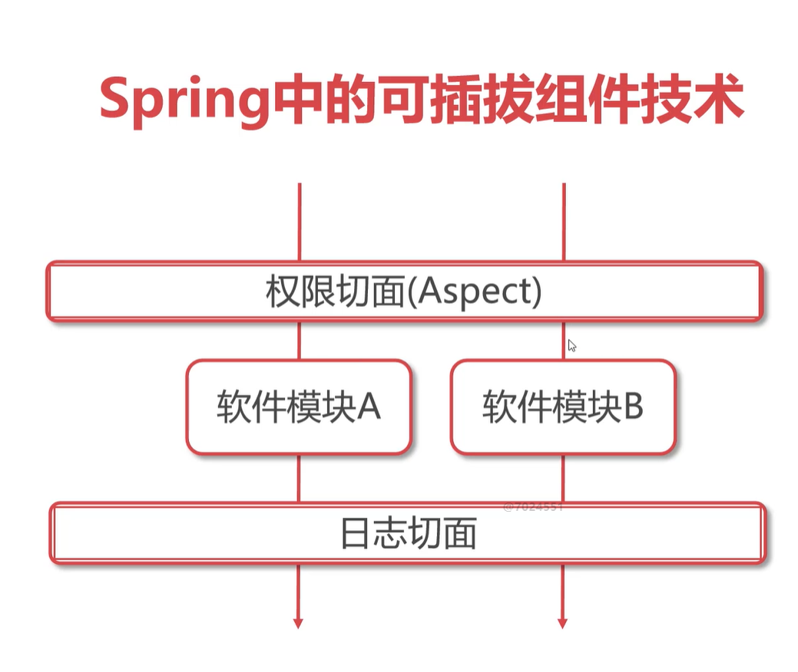

# Spring AOP
> 什么是 Spring AOP
- Spring 中的可插拔组件技术
- Aspect 切面
- 日志切面

- 切面可以简单加入和移除，就像浏览器插件
- 在原有业务模块基础上增加功能，且影响很小;
- Aspect Oriented Programming
- 在不修改源码的情况下对源程序进行扩展

## 依赖配置引入
> spring-context & org.aspectj - aspectjweaver 
> applicationContext 配置文件增加 aop 命名空间

## 引入 AOP 方法
> 项目工程中创建 aspect包
> 创建类，方法，方法携带 joinPoint形参
> 这个方法叫做切面方法
> joinPint及连接点，可以获取目标类/方法信息
> joinPoint.getTarget().getClass().getName()获取目标类名称
> joinPoint.getSignature().getName() 获取目标方法
> applicationContext， 新增一个 bean 指向切面类
> 增加 <aop标签> 声明切换的作用域，并引入这个切面类
